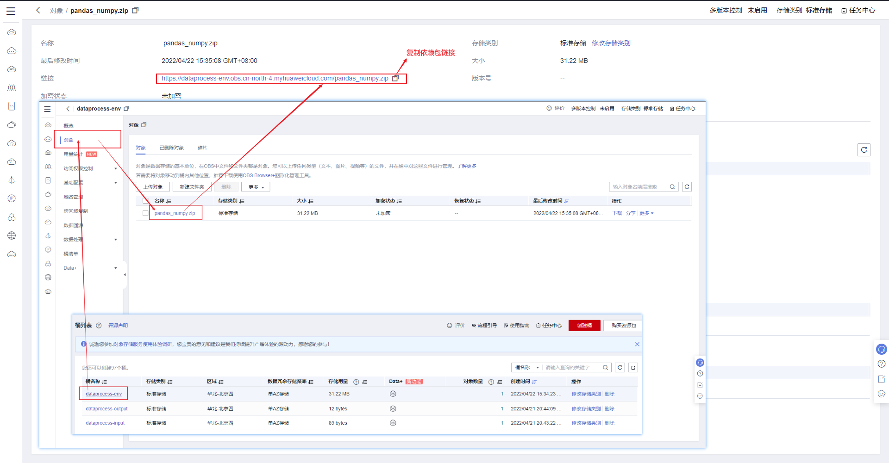
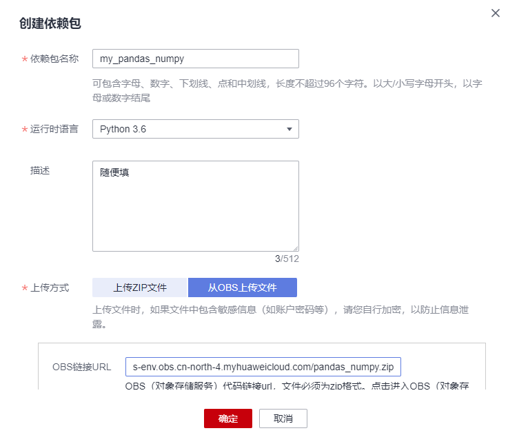
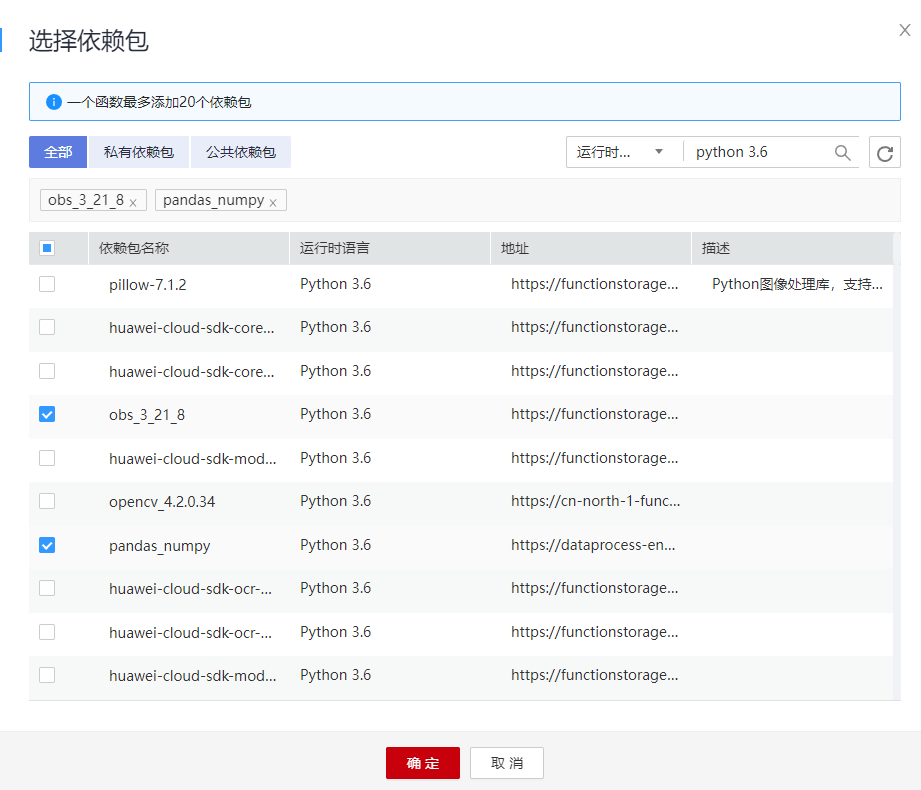

# fss_dataprocess
## 1. 代码结构
```
fss_dataprocess
├─dependency/ - 依赖包
├─dp_metrics/ - 实现的数据处理方法
├─.gitattributes - gitattributes配置文件
├─.gitignore - gitignore配置文件
├─index.py - FunctionGraph入口
├─local_test.py - 本地测试文件
└─README.md - 说明文件
```
- `dependency/pandas_numpy.zip`为依赖包，由于华为自带的`pandas`和`numpy`就是一坨屎，所以需要自行导入。本项目所需的所有依赖包都已经打包成一个`pandas_numpy.zip`文件，到时候直接导入即可。如何导入依赖包在之后的“4. 构建函数工作流”一节会说明。
- `dp_metrics/`下实现数据处理的方法，每个方法以**单个**独立`.py`文件形式存放，这样方便管理，整个调度框架我已经全部写完了，你们只需要关注实现接口即可，详见“2. 任务要求”一节。
- `index.py`的`handler`是FunctionGraph的函数入口。

## 2. 任务要求

### 2.1 目标

用python实现 https://ww2.mathworks.cn/help/matlab/descriptive-statistics.html 或者 https://ww2.mathworks.cn/help/matlab/preprocessing-data.html 的函数接口。或者自行实现别的数据处理方面的函数，记得和我说明。

### 2.2 实现

在项目的`dp_metrics/`目录下实现函数，以单个`.py`文件存放，文件名和函数接口保持一致。详细可以参考`dp_metrics/template.py`作为模板。

实例：实现返回数组的最小元素的数据处理函数，函数名称为`min`。

1. 首先在`dp_metrics/`目录下新建`min.py`文件；

2. `min.py`文件中实现`min`函数功能如下：

```python
import pandas as pd
import numpy as np

'''
返回数组的最小元素
如果 src 是向量，则 min(src) 返回 src 的最小值。
如果 src 为矩阵，则 min(src) 是包含每一列的最小值的行向量。
如果 src 是多维数组，则 min(src) 沿大小不等于 1 的第一个数组维度计算，并将这些元素视为向量。此维度的大小将变为 1，而所有其他维度的大小保持不变。如果 src 是第一个维度为 0 的空数组，则 min(src) 返回与 src 大小相同的空数组。
'''
def min(data):
    src = pd.DataFrame(data['src'])
    return src.min().values.tolist()
```

3. 注意def的函数名称要和文件名称保持一致，否则在`index.py`中无法import。

### 2.3 约束

#### 传入的参数

传入的参数只有一项，用户输入的数据data，以json格式存储。只有单个输入时，data的格式为：

```js
{
    "operation": "...", // 用户指定的操作
    "parameters": [..., ...], // 用户对方法传入的参数，没有则为空list
    "src": [..., ...] // 要进行数据处理的对象
}
```

有多个需要输入时，data的格式为：

```js
{
    "operation": "...", // 用户指定的操作
    "parameters": [..., ...], // 用户对方法传入的参数，没有则为空list
    "src1": [..., ...], // 要进行数据处理的对象
    "src2": [..., ...], // 要进行数据处理的对象
    ...
}
```

根据情况自行取值即可。

#### 返回值

返回值类型要求为list。

## 3. 测试

`local_test.py`可以进行简单的本地测试：

1. 建立用户输入的json文件，根据数据格式填写相应字段
2. 在`local_test.py`中第9行修改TEST_PATH参数，对应上面json文件的路径
3. 运行`local_test.py` print输出

输出数据也是json格式：

```js
{
    “res”: [..., ...] // res项对应的就是你们函数的list输出
}
```

本地测试没问题的话，FunctionGraph中也不会出错。详细的本地测试有待后续更新，先摸了。

## 4. 构建函数工作流

### 4.1 概述

#### 场景介绍

- 将要处理的数据上传到特定的OBS桶中
- 对用户上传的数据进行处理
- 将处理完成的数据上传到另一个指定的OBS桶中
    - 必须使用两个不同的OBS桶
    - 保证函数和OBS桶在同一个区域

#### 实现流程

- 在OBS服务中，创建三个桶。
- 上传依赖包到OBS桶中并设置依赖。
- 创建函数，设置OBS触发器。
- 用户向其中一个桶上传数据。
- 触发函数执行，对数据进行相应处理。
- 函数将处理后的数据上传到指定桶中。
    - 完成后，公有云账户将存在以下资源：
        1. 3个OBS桶（依赖包、上传需要处理的数据、存储处理后的数据）
        2. 一个创建处理数据的函数（fss_dataprocess）
        3. 一个OBS触发器，用来关联函数和OBS桶

### 4.2 准备

创建函数及添加事件源之前，需要创建三个OBS桶，分别用来保存依赖包、用户上传的数据和处理后的数据。OBS桶创建以后，需要创建“委托”，给FunctionGraph函数赋权，确保FunctionGraph函数能够访问到OBS资源。

#### 创建OBS 桶

注意事项

- 依赖桶、上传数据的源桶、输出数据的目标桶和函数必须处于同一个区域下
- 必须使用两个不同的桶。如果使用一个桶，会无限执行函数。（源桶上传数据会触发函数执行，从而无限循环）

#### 操作步骤

1. 登录[对象存储服务控制台](https://storage.huaweicloud.com/obs/)，单击“创建桶”，进入“创建桶”界面。
2. 在“创建桶”界面，填写存储桶信息，别的都默认
    - 区域：根据实际情况设置
    - 桶名称输入：“dataprocess-input” - 这个随便起名，能记住就行
    - 存储别选择：“标准存储”
    - 桶策略选择："私有"
    - 单击“立即创建”，完成源桶创建。

3. 和2一样创建目标桶，别的都一样，桶名称换一个，比如dataprocess-output
4. 和2一样创建依赖桶，别的都一样，桶名称换一个，比如dataprocess-depend
5. 完成桶创建以后，OBS桶列表有三个桶，都在一个区域

#### 创建委托

1. 登录[统一身份认证服务控制台](https://console.huaweicloud.com/iam/)，在左侧导航栏单击“委托”，进入“委托”界面。
2. 单击“创建委托”，进入“创建委托”界面。
3. 填写委托信息。
    - 委托名称：输入“serverless_trust”。
    - 委托类型：选择“云服务”。
    - 云服务：选择“函数工作流 FunctionGraph”。
    - 持续时间：选择“永久”。
    - 权限选择：单击“配置权限”，在“配置权限”界面勾选“Tenant Administrator”，单击“确定”。
4. 单击“确定”，完成权限委托设置。

### 4.3 构建程序

#### 上传依赖包

1. 到之前的创建的dataprocess-depend桶中上传`dependency/`目录下的`pandas_numpy.zip`依赖包。复制OBS中该依赖包的链接。

    

2. 登录FunctionGraph控制台，在左侧导航栏选择“函数 > 依赖包”，进入“依赖包管理”界面。

3. 单击的“创建依赖包”，弹出“创建依赖包”对话框。

4. 设置以下信息。

    - 依赖包名称：您自定义的依赖包名称，用于识别不同的依赖包。
    - 运行时语言：选择运行时语言。
    - 描述：对于依赖包的描述信息，可以不填。
    - 上传方式：OBS上传文件，粘贴之前复制好的依赖包的链接。

    

#### 创建函数

1. 在我们的项目代码的根目录下选中`index.py`和`dp_metrics`，压缩打包为zip文件。注意不能外套目录，`index.py`一定要暴露在压缩包根目录下。

2. 登录[函数工作流控制台](https://console.huaweicloud.com/functiongraph/)，在左侧导航栏选择“函数 > 函数列表”，进入函数列表界面。

3. 单击“创建函数”，进入创建函数流程。

4. 填写函数配置信息

    1. 输入基础配置信息
        - 函数名称输入：“fss_dataprocess”，名字随便
        - 所属应用选择默认的“default”，这个也随便，新建一个也可以，完全不影响
        - 描述输入：随便
        - 委托名称选择创建委托中创建的“serverless_trust”
    2. 输入代码信息
        - 运行时语言选择：“Python 3.6”
        - 函数执行入口输入：“index.handler”
        - 代码选择“上传ZIP文件”，上传第一步打包的zip代码文件
        - 单击右侧“创建函数”，完成函数创建。
    3. 进入fss_dataprocess函数详情页，在“配置”页签，输入环境信息
        - 内存选择：“128”
        - 超时时间输入：“40”
        - 设置环境变量:
            - obs_output_bucket：之前创建OBS桶步骤创建的输出数据存放桶，文档中为dataprocess-output
            - obs_address：OBS桶的Endpoint，比如我是华北-北京4的Endpoint为 obs.cn-north-4.myhuaweicloud.com
        - 单击页面右上角“保存”，保存配置信息

    #### 添加依赖包

    1. 用户进入fss_dataprocess函数详情页，在“代码”页签，单击“添加”，弹出依赖包选择界面，选择公共的obs_3_21_8 Python 3.6依赖包和私有的自己上传的依赖包勾选添加，如图所示：

        

    2. 选择完成后单击“确定”

    3. 单击页面右上角“保存”，保存依赖包信息

### 4.4 添加事件源

1. 用户进入fss_dataprocess函数详情页，在“触发器”页签，单击“创建触发器”，弹出创建触发器界面。
2. 触发器类型选择“存储(OBS)”，填写触发器配置信息
    - 桶选择创建OBS桶中创建的“dataprocess-input”桶
    - 事件选择“Post”、“Put”。
3. 单击"确定"，完成触发器创建

OBS触发器创建以后，当有数据上传或更新至your-bucket-input桶时，生成事件，触发函数执行。

至此函数工作流的搭建就完成了。

### 4.5 数据处理

当数据上传或更新至dataprocess-input桶时，会生成事件，触发函数运行，将数据处理，保存在dataprocess-output桶中。

1. 登录[对象存储服务控制台](https://storage.huaweicloud.com/obs/)，进入dataprocess-input桶对象界面，上传数据json文件。
2. 上传数据至dataprocess-input桶，OBS生成事件触发函数运行，将数据处理存放在dataprocess-output桶。可以在函数详情页日志页签查看函数运行日志。

## 5. Reference

- 函数工作流FunctionGraph文档：https://support.huaweicloud.com/functiongraph/index.html
- 最佳实践: https://support.huaweicloud.com/bestpractice-functiongraph/functiongraph_05_0305.html
- 如何制作函数依赖包: https://support.huaweicloud.com/functiongraph_faq/functiongraph_03_0343.html
- pandas.DataFrame手册: https://pandas.pydata.org/docs/reference/api/pandas.DataFrame.html
- Matlab数据处理函数:
    - https://ww2.mathworks.cn/help/matlab/preprocessing-data.html
    - https://ww2.mathworks.cn/help/matlab/descriptive-statistics.html